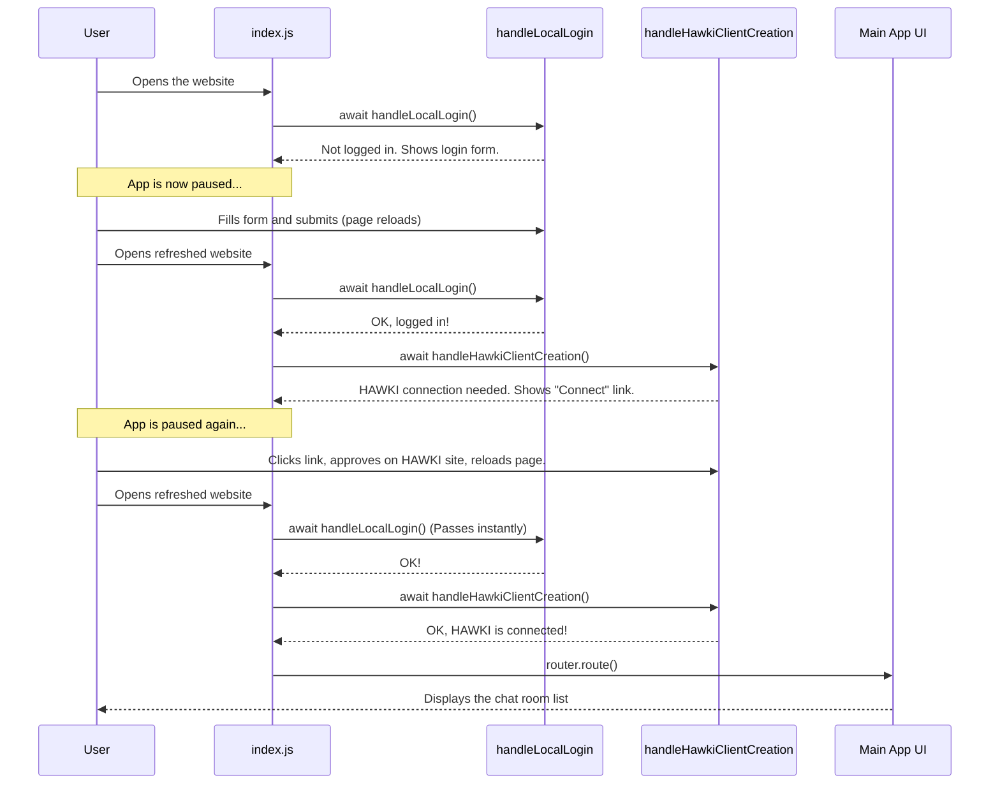

# Chapter 3: Application Bootstrap and Authentication Flow

In the [previous chapter](hawkiclient-integration-reactive-state-1813149943.md), we learned how the magical `HawkiClient` keeps our application's data in sync with the backend. We saw how to subscribe to data "stores" and watch our UI update automatically.

But this raises a question: how does the app get this powerful `HawkiClient` in the first place? It doesn't just appear out of thin air. Before you can start chatting, the application needs to make sure you are who you say you are. This startup and login process is called "bootstrapping".

### The Problem: A Two-Layered Security System

Imagine you're going to a special VIP lounge at an airport. You can't just walk in.
1.  First, you have to get into the airport itself by showing your plane ticket to an agent at the entrance.
2.  Then, once you're inside, you have to go to the lounge and show a special membership card to another agent to be let in.

Our application works exactly the same way. It has two layers of security you must pass before you can see the main chat interface:

1.  **The "Airport Ticket" (Local Login):** You must log in to our example chat application itself. This proves you have an account with *our* service.
2.  **The "Lounge Pass" (HAWKI Connection):** Your account with our service must be connected to and authorized by the central HAWKI service. This proves you have permission to use the core chat features.

Only when you've cleared both security gates does the application let you in. Let's see how our code handles this two-step process.

### The Master Plan: `index.js`

The entire startup sequence is controlled by just a few lines of code in our main `public/js/index.js` file. It acts as the master coordinator for our security checks.

```javascript
// public/js/index.js (simplified)
try {
  // Step 1: Check the "Airport Ticket"
  await handleLocalLogin();

  // Step 2: Check the "Lounge Pass"
  await handleHawkiClientCreation();

  // Success! Let the user in.
  router.route(); 
  
} catch (e) {
  // If anything goes wrong, show an error.
  showAlert('error', `Initialization error: ${e.message}`);
}
```

This code is beautifully simple. It says: "First, try to handle the local login. `await` means we will *wait* until it's finished. If that succeeds, then try to create the HAWKI client connection, and `await` that too. If and only if *both* steps are successful, start the application's router."

Let's dive into each of those `await` steps.

### Gate 1: The Local Login (`handleLocalLogin`)

The first function, `handleLocalLogin`, is responsible for authenticating you with our example application's own backend. Its job is simple: check if you have a valid session.

```javascript
// public/js/bootstrap/handleLocalLogin.js (simplified logic)
async function isLoggedIn() {
  // Asks our own backend: "Is this user logged in?"
  const response = await fetch('/login-status');
  return response.ok;
}

export async function handleLocalLogin() {
  // If the user is already logged in, we're done here!
  if (await isLoggedIn()) {
    return true;
  }
  
  // If not, show the login form and stop.
  renderLoginForm();
  return new Promise(() => {}); // Pause execution forever
}
```

This code does two things:
1.  It calls `isLoggedIn()` to check your status with our server. If you're already logged in, the function finishes (`return true`), and the "master plan" in `index.js` moves on to the next step.
2.  If you're *not* logged in, it calls `renderLoginForm()` to display a username and password form. Then, it does something very clever: `return new Promise(() => {})`. This creates a promise that *never finishes*. It effectively pauses the entire application right there, waiting for you to submit the login form, which will cause a full page reload and start the process over.

### Gate 2: Connecting to HAWKI (`handleHawkiClientCreation`)

Congratulations, you've passed the first gate! You're inside the airport. Now you need to get into the VIP lounge. This is handled by `handleHawkiClientCreation`.

This function's job is to create the `HawkiClient` instance. During creation, the client itself checks if your local account is authorized with the central HAWKI service.

```javascript
// public/js/bootstrap/handleHawkiClientCreation.js (simplified)
export async function handleHawkiClientCreation() {
  client = await HawkiClient.createHawkiClient({
    // ... some config ...
    clientConfigUrl: '/hawki-client-config',
    
    // What to do if the user needs to grant permission?
    onConnectionRequired: async (connectionUrl) => {
      renderConnectRequest(connectionUrl);
      return new Promise(() => {}); // Pause again!
    }
  });
}
```

The most important part here is `onConnectionRequired`. This is a function you provide to the `HawkiClient`. The client calls it *only if* it detects that you need to grant permission.

*   `connectionUrl`: The `HawkiClient` gives you a special link. This link takes the user to the HAWKI website to approve the connection.
*   `renderConnectRequest(connectionUrl)`: Our helper function displays a message like, "Please connect your account," and shows a button with this special link.
*   `return new Promise(() => {})`: Just like our login form, we pause the application again, waiting for the user to click the link, approve the connection on the HAWKI site, and then come back or refresh the page.

### The Full Flow in Action

Let's trace the entire journey of a first-time user.



As you can see, the application will not proceed until both security gates are successfully passed. Once you're logged in locally and connected to HAWKI, subsequent visits to the site will be instant, as both `handleLocalLogin` and `handleHawkiClientCreation` will pass immediately.

### Conclusion

You've now seen the full startup sequence of our application, from a blank screen to a fully authenticated state.

*   The application bootstrap is a **two-step authentication flow** controlled from `index.js`.
*   **Gate 1 (`handleLocalLogin`)** authenticates you with the example application's own backend.
*   **Gate 2 (`handleHawkiClientCreation`)** initializes the `HawkiClient` and ensures your account is authorized by the core HAWKI service.
*   The application cleverly **pauses execution** by showing a UI and returning an unresolved Promise, waiting for the user to take action.
*   Only after both gates are passed does the application's main interface load via the [Simple Hash-Based Router](simple-hash-based-router-174192633.md).

Now that we are successfully logged in and the main app is ready to go, let's take a closer look at the "traffic cop" that directs us to different pages.

Next, we will explore the [Chapter 4: Simple Hash-Based Router](simple-hash-based-router-174192633.md).

