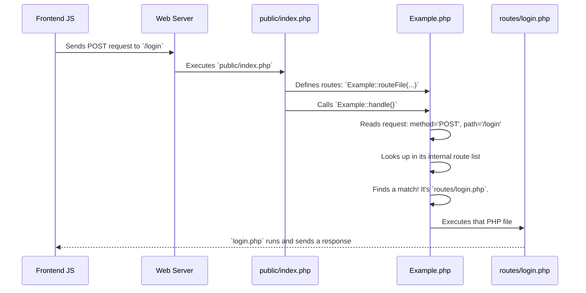

# Chapter 7: Custom Micro-Router: Handling Backend Requests

In the [previous chapter](function-based-ui-components-740881728.md), we saw how our frontend application is built from small, reusable UI pieces called components. Many of these components, like the login form or the avatar uploader, need to communicate with a server to save or retrieve data.

But this brings up a new question: what happens on the *other side* of that communication? When our JavaScript sends a request like `POST /login` to our backend, how does the server know what to do? This chapter pulls back the curtain on our simple PHP backend and the clever "switchboard" that directs all incoming requests.

### The Problem: A Server with Many Jobs

Imagine our backend is like a small office building. It has different departments for different tasks: a "Login Department," a "Logout Department," a "Configuration Department," and so on.

When a request arrives at the front door, it's like a phone call. The caller says, "I'd like to speak to the Login department." How does the building's receptionist know which extension to dial? Without a company directory, the call would go nowhere.

Our backend needs that company directory. It needs a system to look at an incoming request (e.g., a `POST` request to the `/login` path) and connect it to the correct piece of code (the "department") that can handle it.

### The Solution: A Custom Micro-Router

Most large PHP projects use a big, powerful framework like Laravel or Symfony to handle this. These frameworks are like enormous, automated switchboard systems for a massive corporation.

For our simple example project, that would be overkill. Instead, we use a small, custom-built "micro-router." It's a single PHP class called `Example.php` that acts as our friendly office receptionist. Its job is to look at the request and forward it to the right place.

The entire process works with three key pieces:

1.  **The Front Door (`public/index.php`):** This is the single entry point for all backend requests. Every request, no matter the URL, is first handled by this file.
2.  **The Directory (`Example::routeFile`):** Inside `public/index.php`, we use a function to build our "company directory." We tell our micro-router which "departments" (PHP files in the `routes/` directory) handle which calls.
3.  **The Operator (`Example::handle`):** After the directory is set up, this function is called. It looks at the current call, finds the right department in the directory, and connects the call.

### Building the "Company Directory"

Let's look at the front door, `public/index.php`. This is where we define all the "routes" our backend knows about.

```php
// backend/public/index.php (Simplified)

// 1. Include the router class
require_once __DIR__ . '/../Example.php';

// 2. Define the routes (our "directory")
Example::routeFile('POST', '/login', __DIR__ . '/../routes/login.php');
Example::routeFile('GET', '/logout', __DIR__ . '/../routes/logout.php');
Example::routeFile('GET', '/login-status', __DIR__ . '/../routes/getLoginStatus.php');

// 3. Tell the operator to start handling calls
Example::handle();
```

This is incredibly simple and readable:
*   `Example::routeFile('POST', '/login', ...)` says: "If a `POST` request for the `/login` path comes in, execute the `routes/login.php` file."
*   `Example::routeFile('GET', '/logout', ...)` says: "If a `GET` request for `/logout` comes in, execute `routes/logout.php`."

After defining all our routes, the single call to `Example::handle()` kicks the whole system into gear.

### How the Switchboard Operates

Let's trace what happens when our frontend sends a `POST` request to log a user in.



1.  **Request Arrives**: The user submits the login form, and the JavaScript sends a `POST` request to `/login`.
2.  **Front Door**: The web server is configured to send all such requests to our `public/index.php` file.
3.  **Build Directory**: The `index.php` script runs from the top. It calls `Example::routeFile` several times, building up an internal "map" of routes inside the `Example` class.
4.  **Handle Call**: `Example::handle()` is called. It looks at the server variables to find the request method (`POST`) and path (`/login`).
5.  **Find Match**: It checks its internal map for an entry matching `POST` and `/login`. It finds one! The associated value is the path to the `routes/login.php` file.
6.  **Execute Handler**: The router then simply `require_once`s the `routes/login.php` file. The code inside that file takes over, checks the user's password, and sends a success or failure response back to the frontend.

### A Peek Inside the `Example.php` Class

The "magic" of the router is actually quite simple. Let's look at the key functions inside `Example.php`.

First, the `routeFile` and `route` methods work together to build the internal map.

```php
// backend/Example.php (Simplified)

private static array $routes = [];

public static function route(string $method, string $route, callable $callback): void
{
  // Stores the handler function in a big array, keyed by method and route.
  // Example: $routes['POST']['login'] = //... some function
  self::$routes[$method][$route] = $callback;
}

public static function routeFile(string $method, string $route, string $routeFile): void
{
  // A helper that creates a simple function to include the file.
  self::route($method, $route, function () use ($routeFile) {
    require_once $routeFile;
  });
}
```
As you can see, all it does is populate a `$routes` array. This is our "company directory" map.

Next, the `handle` method uses this map to do the actual routing.

```php
// backend/Example.php (Simplified)

public static function handle(): void
{
  $route = $_GET['route'] ?? ''; // e.g., 'login'
  $method = $_SERVER['REQUEST_METHOD']; // e.g., 'POST'
  
  if (isset(self::$routes[$method][$route])) {
    // We found it! Call the associated function.
    self::$routes[$method][$route](); 
    exit(); // Stop right here.
  }

  // If no route was found, show a 404 error page.
  self::show404();
}
```
This is the core of our switchboard. It gets the current route and method, looks it up in the array, and if it finds a match, it executes the stored handler function and we're done. Simple, effective, and easy to understand.

### Conclusion

You've just learned how the entire backend of our example project is structured. It might not have the bells and whistles of a major framework, but it's a clear and powerful pattern.

*   Our backend uses a **custom micro-router** defined in `Example.php` to handle incoming requests.
*   All requests go through a single entry point: `public/index.php`.
*   In `index.php`, we define a "route map" using `Example::routeFile`, linking a **method** and **path** to a specific **handler file**.
*   The `Example::handle` function acts as a switchboard, matching the incoming request to the map and executing the correct file from the `routes/` directory.

Now that we know how a request like `/login` is routed to the `routes/login.php` file, what exactly happens inside that file? How do we check a user's password and manage their logged-in state?

Next, we'll dive into the specifics of how our application handles user sessions.

[Chapter 8: Mock Authentication & Session Management](mock-authentication-session-management-881906585.md)

