# Chapter 6: Function-based UI Components

In the [previous chapter](page-controllers-and-lifecycle-1365675545.md), we explored the lifecycle of our Page Controllers. We saw how they set up a page, manage its active state, and, crucially, clean up after themselves when the user navigates away.

While this pattern keeps our app clean, you might have noticed that some of our page controllers, like `roomDetailsPage.js`, are getting quite large. They're trying to do everything: render the main layout, create form fields, handle button clicks, and so on. What if we want to use the same avatar-upload widget on both the user profile page *and* the room details page? We don't want to copy and paste the same complicated code in two different places.

This is where the idea of reusable components comes in.

### The Problem: Rebuilding the Same Legos

Imagine you are building a Lego house. You need a door, two windows, and a roof. Now imagine you have to build every single one of those—the window frame, the door handle, each individual roof tile—from the tiniest, most basic bricks every time you want to build a house. It would be slow, repetitive, and super easy to make a mistake.

This is what happens when all our UI logic lives inside big page controllers. We end up rebuilding the same "UI widgets" (like a fancy search box or a file uploader) over and over.

Wouldn't it be better if Lego gave you a pre-built window piece and a pre-built door piece? Then you could just snap them into place.

### The Solution: Functions that Build UI "Pieces"

In our project, we use a simple but powerful pattern to create these "pre-built" UI pieces. We don't use a big framework like React or Vue. Instead, we have **Function-based UI Components**.

A component function is just a regular JavaScript function that has one special job:
1.  It accepts some configuration options as arguments.
2.  It uses pure JavaScript to build a piece of the user interface (a DOM element). This includes its HTML, its styles, and its internal logic (like what happens when you click a button inside it).
3.  It returns the finished, fully-functional `HTMLElement`.

The Page Controller can then take this element and "snap" it into place on the page. These component functions live in the `public/js/components/` directory.

### Using Our First Component: `avatarField`

Let's look at a real-world example. Both the `userProfilePage` and the `roomDetailsPage` need an avatar uploader. We have a component for that called `avatarField`.

Here's how the `userProfilePage` uses it:

```javascript
// public/js/routes/userProfilePage.js (Simplified)
import { avatarField } from '../components/avatarField.js';

// ... other code ...

function renderForm(currentUser) {
  // 1. Create the main page template
  const tpl = document.createElement('div');
  tpl.innerHTML = `
    <h2>User Profile</h2>
    <div id="avatar-field-container"></div>
    <input type="submit" value="Save Changes">
  `;

  // 2. Call the component function to get the avatar widget
  const avatarWidget = avatarField(
    client,
    currentUser.avatar,
    (file) => client.profile.setAvatar(file)
  );

  // 3. Snap the widget into the template
  tpl.querySelector('#avatar-field-container').appendChild(avatarWidget);
  
  setAppContent(tpl);
}
```

Let's break this down:
1.  **Import**: First, we import our component function, `avatarField`.
2.  **Call**: We call `avatarField()` like any other function. Notice the arguments we pass:
    *   `client`: The component needs the `HawkiClient` to do its work.
    *   `currentUser.avatar`: We tell it what the current avatar is so it can display it.
    *   A function `(file) => client.profile.setAvatar(file)`: This is the most brilliant part. We give the component a "callback" function. We're telling it, "When a user uploads a file, run *this specific* function." The component itself doesn't know or care about `client.profile.setAvatar`. It only knows it needs to call the function it was given.
3.  **Append**: The `avatarField` function returns a complete `HTMLDivElement`. We simply take that element and place it inside our page's template.

This makes our `userProfilePage` code incredibly clean. All the messy logic for handling file inputs, showing previews, and managing uploads is hidden away inside `avatarField.js`. And if we want an avatar uploader on the `roomDetailsPage`, we just call the same function but provide a *different* callback: `(file) => client.rooms.setAvatar(room, file)`. The component is completely reusable!

### A Look Inside a Component Function: `avatarField.js`

So what does the `avatarField` function itself look like? Let's peek behind the curtain.

```mermaid
sequenceDiagram
    participant PC as userProfilePage
    participant AF as avatarField
    participant H as HTMLElement
    participant D as DOM

    PC->>AF: calls avatarField(client, avatar, doUpload)
    AF->>H: Creates base div: <div class="container">...</div>
    AF->>H: Adds <input type="file"> and a preview area
    AF->>H: Adds an "input.onchange" event listener
    Note over AF,H: The listener will call the `doUpload` function.
    AF-->>PC: returns the complete HTMLDivElement
    PC->>D: Appends the returned element to the page
```



Here is a simplified version of its code:

```javascript
// public/js/components/avatarField.js (Simplified)

export function avatarField(client, avatarFile, doUpload) {
  // 1. Create the main container for our widget
  const fieldContainer = document.createElement('div');
  fieldContainer.innerHTML = `
    <label>Avatar:</label>
    <div id="avatar-preview"></div>
    <input type="file" id="avatar-input">
  `;

  // 2. Get references to the important inner elements
  const avatarInput = fieldContainer.querySelector('#avatar-input');
  
  // ... code to show the current avatar in the preview ...

  // 3. Set up internal event handling
  avatarInput.addEventListener('change', async (e) => {
    const file = e.target.files[0];
    if (file) {
      // Here's the magic! Call the function we were given.
      await doUpload(file).done;
      alert('Avatar updated!');
    }
  });

  // 4. Return the finished element
  return fieldContainer;
}
```

As you can see, the component function's job is to encapsulate a self-contained piece of UI.
1.  It creates a DOM structure.
2.  It sets up its own internal event listeners.
3.  When an event happens, it uses the callbacks and data it received as arguments to perform an action.
4.  Finally, it hands off the finished product, ready to be used.

### Another Example: `autocompleteField`

This pattern is used for other complex widgets, too. In the `roomMembersPage`, when you want to invite a new user, you see a search box that shows suggestions as you type. This is powered by the `autocompleteField` component.

The `roomMembersPage` controller calls it like this:

```javascript
// public/js/routes/roomMembersPage.js (Usage)

const autocomplete = autocompleteField(
  'Invite new users',
  'invite',
  // A function to fetch suggestions
  (query) => client.rooms.members.getInviteOptions(room, query),
  // A function to handle selection
  (selectedUser) => selectedUser.invite('viewer')
);

// Then, it appends `autocomplete` to the page.
```
This is the same pattern! The page controller doesn't care about debouncing input, making API calls, or drawing the suggestion dropdown. It just tells the `autocompleteField` component *how* to fetch data and *what* to do when an item is selected.

### Conclusion

You've just unlocked a key strategy for keeping our frontend code clean, modular, and easy to maintain, even without a heavy framework.

*   We avoid large, complex Page Controllers by breaking down our UI into smaller, reusable pieces.
*   These pieces are **Function-based UI Components**: simple functions in `public/js/components/` that build and return a fully-formed `HTMLElement`.
*   Components are made flexible and reusable by accepting **configuration parameters**, especially **callback functions** that tell the component what to do on certain events (like a button click or file upload).
*   Page Controllers act as "assemblers," calling component functions to get pre-built UI widgets and snapping them into the page layout.

Many of our components, like the `autocompleteField`, need to fetch data from custom backend endpoints. But how does our frontend know which URLs to call? How do we manage API requests that go beyond the basic reactive features of the `HawkiClient`?

Next, we'll dive into the clever system we use to manage all our backend API calls.

[Chapter 7: Custom Micro-Router: Handling Backend Requests](custom-micro-router-handling-backend-requests-971788828.md)

