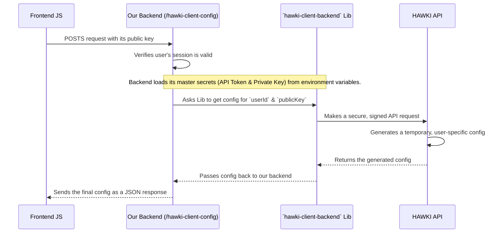

# Chapter 9: HAWKI Configuration Broker

In the [previous chapter](mock-authentication-session-management-881906585.md), we established a secure way for our server to know who a user is using a simple session system. Now that our server can confidently say, "Hello, user #1," we need to solve the final, most important puzzle: how do we connect this authenticated user to the central HAWKI service?

### The Problem: The Un-secret Secret Agent

Our frontend needs to establish a direct, secure connection to the HAWKI service to get real-time chat updates. To do this, it needs credentials. But here's the catch: our frontend is pure JavaScript running in a user's browser. Anything in that JavaScript code—including secret keys or tokens—can be seen by anyone who knows how to "View Page Source."

Putting your application's master secret key in your frontend code would be like an undercover agent wearing a t-shirt that says, "I AM A SPY AND THE SECRET PASSWORD IS 'BLUEBIRD'". It’s a terrible idea.

So, how can our frontend get the credentials it needs to talk to HAWKI without ever knowing the master secret?

### The Solution: The Backend as a Trusted Broker

The solution is to turn our backend into a **secure configuration broker**. Think of it like a highly secure bank vault manager.

1.  **You (The Frontend):** You walk up to the manager's desk. You don't have the key to the main vault.
2.  **Prove Your Identity:** You show the manager your ID (your session cookie). The manager checks it and confirms who you are.
3.  **The Manager (Our Backend):** The manager, who is the *only one* with the master key to the main vault, goes inside.
4.  **A Special Request:** The manager retrieves a special, temporary keycard from the vault that is issued specifically *for you* and will only work for a short time.
5.  **The Handover:** The manager gives you this temporary keycard (the HAWKI configuration).
6.  **Access Granted:** You can now use your temporary keycard to access your own personal safety deposit box (connect to the HAWKI service) without ever touching the master vault key.

This is precisely what our backend's `/hawki-client-config` endpoint does. It uses its master secrets, which are safely stored on the server, to request a secure, user-specific configuration from HAWKI and then passes it along to the verified frontend client.

> **Learn more**
> 
> To simplify the process of creating the broker, there is a dedicated PHP composer package you can install using `composer require hawk-hhg/hawki-client-backend`.
> While this chapter covers the basics, if you need to know more, hop over [to the package documentation](https://github.com/hawk-digital-environments/hawki-client-backend-php).

### The Brokerage Process in Action

Let's follow the entire flow from the frontend's request to the final configuration.



1.  The frontend client makes a `POST` request to our `/hawki-client-config` endpoint. It sends along a piece of data called a `public_key`, which helps secure the future connection.
2.  Our backend first checks the user's session to make sure they are a logged-in user.
3.  It then uses the `hawk-hhg/hawki-client-backend` library, feeding it the master `HAWKI_API_TOKEN` and `HAWKI_PRIVATE_KEY` that are stored securely in environment variables on the server.
4.  It calls a function on this library, saying "Please get me a client configuration for this specific `userId` and this `public_key`."
5.  The library handles all the complex cryptography, making a secure request to the HAWKI API.
6.  The HAWKI API validates the request, generates a unique configuration, and sends it back.
7.  Our backend receives this configuration and immediately forwards it to the frontend as a JSON response.

The frontend now has everything it needs to create its own `HawkiClient` and connect directly to the service. The master secrets were never exposed.

### A Look at the Broker's Code: `getHawkiClientConfig.php`

The code that performs this critical task is located in `backend/routes/getHawkiClientConfig.php`. Let's break it down piece by piece.

**Step 1: The Bouncer**

First, just like at any exclusive club, we check the user's ID. If they don't have a valid session, they're not getting in.

```php
// backend/routes/getHawkiClientConfig.php
session_start();
if (empty($_SESSION['userId'])) {
    http_response_code(401); // Unauthorized
    exit;
}
```
This is the same gatekeeper pattern from our [Mock Authentication & Session Management](mock-authentication-session-management-881906585.md) chapter, ensuring only logged-in users can proceed.

**Step 2: Check the Paperwork**

The frontend must provide its `public_key`. If it doesn't, we can't fulfill the request.

```php
// backend/routes/getHawkiClientConfig.php
if (empty($_POST['public_key'])) {
    http_response_code(400); // Bad Request
    exit;
}
```

**Step 3: Prepare the Master Key**

Next, we instantiate the `HawkiClientBackend` library. We fetch the master secrets using `getenv()`, which securely reads them from the server's environment variables.

```php
// backend/routes/getHawkiClientConfig.php
$hawkiApp = new HawkiClientBackend(
    hawkiUrl: getenv('HAWKI_URL'),
    apiToken: getenv('HAWKI_API_TOKEN'),
    privateKey: getenv('HAWKI_PRIVATE_KEY'),
    //... other options
);
```
This is the most sensitive part of the operation, and it happens entirely on the server, hidden from the outside world.

**Step 4: Make the Request**

Finally, we call the `getClientConfig` method with the user's ID from the session and the public key from the frontend. We then `echo` the result as a JSON string.

```php
// backend/routes/getHawkiClientConfig.php
try {
    echo json_encode($hawkiApp->getClientConfig(
        $_SESSION['userId'],
        $_POST['public_key']
    ));
} catch (Exception $e) {
    // If anything goes wrong, send a server error.
    http_response_code(500);
}
```
And that's it! The backend's job is done. It has successfully acted as a broker, handing off a secure, temporary "keycard" to the frontend.

### Conclusion

Congratulations! You have now journeyed through all the core components of the `hawki-client-example` project. In this final chapter, you've learned the crucial role the backend plays:

*   The backend acts as a **secure broker** to protect the application's master secrets.
*   It exposes a `/hawki-client-config` endpoint that is protected by our session-based authentication.
*   It uses the `hawki-client-backend` library along with secret credentials to request a **temporary, user-specific configuration** from the HAWKI API.
*   This process allows the frontend to securely connect to HAWKI without ever being exposed to the high-privilege master keys.

From the simple [Vanilla JS SPA Architecture & Workflow](vanilla-js-spa-architecture-workflow-444335064.md) to the powerful [HawkiClient Integration & Reactive State](hawkiclient-integration-reactive-state-1813149943.md), and all the way through routing, components, and backend logic, you now have a complete picture of how a modern, real-time web application can be built and secured. We hope this tour has given you the knowledge and confidence to start building your own amazing applications with HAWKI

## Stepping Beyond the Core: Embracing Infrastructure

With our HAWKI Configuration Broker now securing the bridge between client and server, we turn our gaze outward—to the foundational layer that supports and sustains the entire system. In the next chapter, we'll dive into the nuts-and-bolts of project infrastructure setup and management, ensuring your application scales, deploys, and operates seamlessly in the real world. Get ready to build the bedrock of reliability as we explore [Infrastructure](infrastructure-610545213.md).
