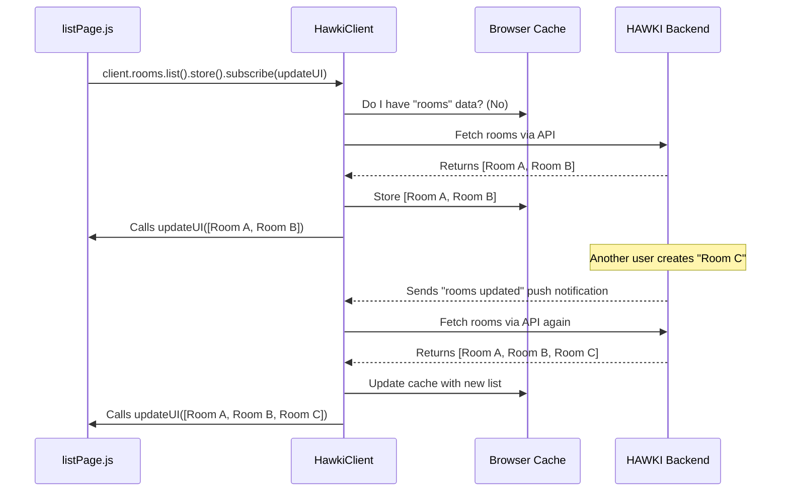

# Chapter 2: HawkiClient Integration & Reactive State

In the [previous chapter](vanilla-js-spa-architecture-workflow-444335064.md), we built the skeleton of our Single Page Application. We have a "stage" (`<div id="app">`), a "traffic cop" (our router), and "scene builders" (our page functions). However, our scenes are static and lifeless. They don't display any real data from our backend.

Let's change that. How do we fetch the list of chat rooms from the server? And more importantly, how do we make sure our UI automatically updates when a new room is created or a new message arrives, without having to hit the refresh button?

This is where the `HawkiClient` comes in. It's the most important piece of the HAWKI frontend puzzle.

### The Problem: Keeping Data in Sync

Imagine you fetch a list of rooms and display them.

1.  Your JavaScript asks the server, "What are the rooms?"
2.  The server replies, `["General", "Random"]`.
3.  You then build the HTML to show these two rooms.

But what happens if, five seconds later, another user creates a new room called "Tech Talk"? Your page still shows only "General" and "Random". The UI is out of sync with the server.

The traditional solution is to constantly ask the server again and again, "Anything new? Anything new?". This is called "polling" and it's inefficient and complex to manage. There must be a better way.

### The Solution: The `HawkiClient` and Reactive State

The `HawkiClient` is the central nervous system of our application. It's the **one and only** component that talks to the HAWKI backend. It acts as both an API client (for fetching data) and a state manager (for keeping that data fresh).

Think of it like a subscription to your favorite magazine. Instead of going to the newsstand every day to see if a new issue is out (polling), you subscribe once. Now, the new issue is delivered to your door automatically whenever it's published.

The `HawkiClient` works the same way. You don't just ask for data once. You "subscribe" to it.

### Getting to Know the HawkiClient

First, let's see how we get access to this powerful tool. The `HawkiClient` is created only once when our application first starts. We then use a helper function to get this single, shared instance anywhere we need it.

```javascript
// public/js/bootstrap/handleHawkiClientCreation.js (simplified)
let client = null;

// This function is called once when the app starts
export async function handleHawkiClientCreation() {
  client = await HawkiClient.createHawkiClient({ /* ...config... */ });
  // We'll explore the config in the next chapter!
}

// This function lets us get the client from any page
export function getHawkiClient() {
  if (client === null) {
    throw new Error('Hawki client not initialized yet');
  }
  return client;
}
```

Any "page" function that needs to talk to the backend will start by calling `getHawkiClient()`.

### From Data Request to Data "Store"

Here's the magic. When you use the `HawkiClient` to fetch data, you don't just get a one-time result. You get a "Store". A store is an object that holds your data and lets you subscribe to its changes.

Let's apply this to our `listPage` to fetch and display our chat rooms.

**1. Get the Client and the Basic HTML**

Inside `listPage.js`, we'll start by getting the client instance and setting up our page's basic HTML structure.

```javascript
// public/js/routes/listPage.js (simplified)
import {setAppContent} from '../utils.js';
import {getHawkiClient} from '../bootstrap/handleHawkiClientCreation.js';

export function listPage(goTo) {
  const client = getHawkiClient();
  
  // Create a placeholder for our rooms
  const appTpl = document.createElement('div');
  appTpl.innerHTML = '<h1>Rooms</h1><div id="rooms">Loading...</div>';
  const appRooms = appTpl.querySelector('#rooms');
  
  setAppContent(appTpl);
  // ... more to come
}
```
This sets up our page with a "Loading..." message. Now, let's fetch the real data.

**2. Get the "Store" and Subscribe**

Instead of a one-time fetch, we'll get the `rooms` store and subscribe to it.

```javascript
// continuation of listPage function...

// This doesn't fetch data yet. It just gives us the "magazine subscription".
const roomListStore = client.rooms.list().store();

// Now we subscribe. The function we provide will be called
// immediately with the current data, and again whenever it changes.
return roomListStore.subscribe(async (rooms) => {
  // `rooms` is an array like [{ name: 'General' }, { name: 'Random' }]
  const roomListElement = await renderRooms(rooms); // A helper to build HTML
  appRooms.replaceChildren(roomListElement);
});
```

That's it! Let's break down that `subscribe` call:
*   We pass it a function. This function is our UI "renderer".
*   The `HawkiClient` immediately calls this function with the current list of rooms. Our "Loading..." message is replaced with the actual room list.
*   Behind the scenes, the client keeps a connection open to the server. If a new room is created, the client gets notified, fetches the new list, and automatically calls our function *again* with the updated `rooms` array.
*   Our UI redraws itself automatically, with zero extra code from us!

The `return` statement is also important. It returns an `unsubscribe` function. Our [Page Controllers and Lifecycle](page-controllers-and-lifecycle-1365675545.md) system uses this to clean up the subscription when the user navigates to a different page.

### How Does It Work Under the Hood?

This might seem like magic, so let's peek behind the curtain. The `HawkiClient` is orchestrating a clever dance between your browser and the backend.



1.  **Subscription:** Your `listPage` subscribes to the `rooms` store.
2.  **First Fetch:** The `HawkiClient` checks its internal cache. It's empty, so it makes a standard API request to the backend to get the rooms.
3.  **Cache & Render:** It receives the data, saves it in the browser's local storage (the cache), and passes it to your `subscribe` function to render the UI.
4.  **Listen:** The client maintains a persistent connection (a WebSocket) to the backend, like an open phone line.
5.  **Server Push:** When another user creates a room, the backend doesn't wait for you to ask. It sends a tiny "push" notification over the open connection, saying, "The room list has changed!"
6.  **Re-fetch & Re-render:** The `HawkiClient` receives this push, automatically re-fetches the updated room list, updates its cache, and calls your `subscribe` function again with the new data. The UI updates instantly.

### Actions vs. Queries

So far, we've only talked about fetching data ("queries"). What about *changing* data, like creating a new room? These are called "actions".

Actions are different. They don't return a store because you're not subscribing to a change, you're *causing* one. Instead, they return a standard JavaScript `Promise`, which just tells you when the action is finished.

```javascript
// in listPage.js, inside a button's click handler
button.addEventListener('click', async () => {
  const roomName = prompt('Enter new room name:');
  if (roomName) {
    // This is an "action", it returns a Promise.
    await client.rooms.create({ name: roomName });
    
    // That's it! Nothing else to do.
  }
});
```
Notice what's missing? There's no code to manually add the new room to our UI. We don't need it!

After `client.rooms.create()` succeeds, the backend will send that "rooms updated" push notification. Our `roomListStore` subscription, which we set up earlier, will hear it and automatically re-render the list, now including the new room. This is the incredible power and simplicity of a reactive architecture.

### Conclusion

You've just learned the core concept that drives the entire `hawki-client-example` application.

*   The `HawkiClient` is our single source of truth and our only connection to the backend.
*   For fetching data (**queries**), we use `.store().subscribe()` to get a reactive "store" that automatically provides updates.
*   This "reactive state" model eliminates the need for manual data synchronization, making our code simpler and our UI more robust.
*   For changing data (**actions**), we call methods that return a `Promise`. The reactive system handles updating the UI as a result of our actions.

Now that we understand what the `HawkiClient` does, let's look at how the application boots up and gets this client connected in the first place. This process involves authenticating the user and is the first thing that happens when someone visits our app.

Next up: [Chapter 3: Application Bootstrap and Authentication Flow](application-bootstrap-and-authentication-flow-1587883851.md)

