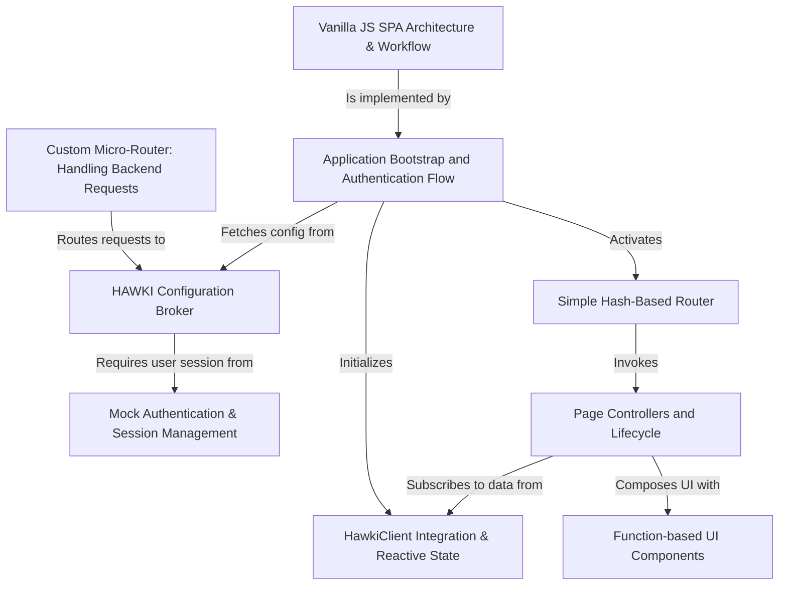

# Tutorial: hawki-client-example

This project is a simple chat application that demonstrates how to integrate a web app with the **HAWKI** real-time communication service.
It consists of a basic PHP *backend* that handles user login and securely provides configuration, and a vanilla JavaScript *frontend* that acts as a Single Page Application (SPA).
The frontend uses the `HawkiClient` library to manage all data, featuring a *reactive state model* that automatically updates the UI when data changes.

**Source Repository:** [git@github.com:hawk-digital-environments/hawki-client-example.git](git@github.com:hawk-digital-environments/hawki-client-example.git)

## Chapters

1. [Getting Started](getting-started-929492837.md)
1. [bin/env - Your local dev helper](bin-env-your-local-dev-helper-862670637.md)
1. [Vanilla JS SPA Architecture & Workflow](vanilla-js-spa-architecture-workflow-444335064.md)
1. [HawkiClient Integration & Reactive State](hawkiclient-integration-reactive-state-1813149943.md)
1. [Application Bootstrap and Authentication Flow](application-bootstrap-and-authentication-flow-1587883851.md)
1. [Simple Hash-Based Router](simple-hash-based-router-174192633.md)
1. [Page Controllers and Lifecycle](page-controllers-and-lifecycle-1365675545.md)
1. [Function-based UI Components](function-based-ui-components-740881728.md)
1. [Custom Micro-Router: Handling Backend Requests](custom-micro-router-handling-backend-requests-971788828.md)
1. [Mock Authentication & Session Management](mock-authentication-session-management-881906585.md)
1. [HAWKI Configuration Broker](hawki-configuration-broker-2105373639.md)
1. [Infrastructure](infrastructure-610545213.md)

