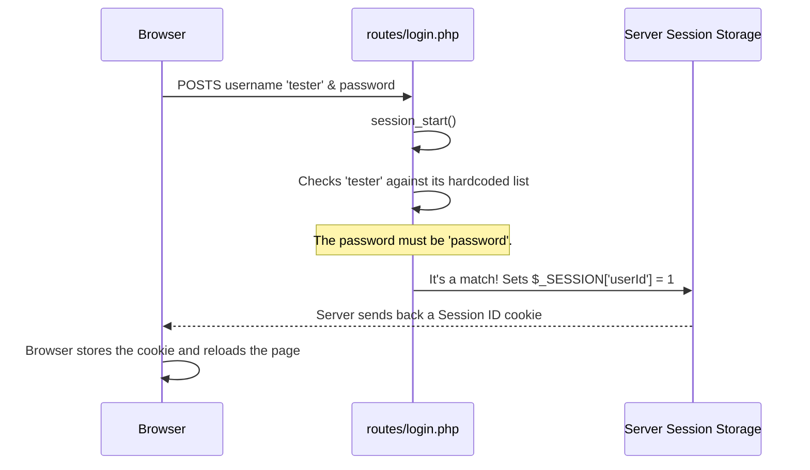

# Chapter 8: Mock Authentication & Session Management

In the [previous chapter](custom-micro-router-handling-backend-requests-971788828.md), we acted as switchboard operators, directing incoming backend requests to the correct PHP handler files. We learned how a `POST` request sent to `/login` is neatly routed to the `backend/routes/login.php` file.

But what happens inside that file? How does our application actually verify a user's identity and, more importantly, *remember* that they are logged in as they navigate from page to page? This chapter explores the simple, yet effective, "mock" authentication system that makes our example app work.

### The Problem: Server Amnesia

Imagine you visit a coffee shop. You order a latte and pay for it. A minute later, you ask the barista, "Is my latte ready?" and they respond, "Who are you? I've never seen you before. Please place an order." Frustrating, right?

By default, web servers are just like that forgetful barista. Every time your browser makes a new request, the server sees it as a brand-new interaction from a complete stranger. So, if you log in on one page, how does the server know it's still you when you visit another page a second later?

We need a system to give our users a "receipt" so the server can recognize them on subsequent visits.

### The Solution: PHP Sessions as a Hall Pass

Our application uses one of the oldest and simplest tricks in the book: **PHP Sessions**. Think of it like this:

1.  When you first visit a school, you go to the front office and show your ID.
2.  The receptionist gives you a temporary "Hall Pass" with your name on it.
3.  As you walk around the school, any teacher who stops you doesn't need to see your main ID again; they just look at your Hall Pass.

PHP sessions work exactly the same way:
*   **The Hall Pass:** The `$_SESSION` variable in PHP. This is a special array where we can store information about a user (like their ID). This data is kept on the **server**.
*   **The Lanyard:** A special cookie, called a session ID, that the server gives to the browser. The browser automatically shows this cookie with every single request it makes back to the server.
*   **The Magic:** The `session_start()` function. When you call this at the top of a PHP file, it looks for the session ID cookie from the browser and automatically loads the correct "Hall Pass" (`$_SESSION` data) for that user.

### The Login Flow in Action

Let's see how `backend/routes/login.php` uses this system. When you submit the login form, this script runs on the server.



**1. Finding the User**

First, the script checks if the provided username exists in a hardcoded list.

> **Warning:** This is a **mock authentication** system for demonstration only. We are storing usernames in a list and checking for a single, hardcoded password. **Never do this in a real application!**

```php
// backend/routes/login.php (Simplified)

// A hardcoded list of users for our example.
const USERS = [
  [1, 'tester'],
  [2, 'admin'],
  // ...and so on
];

// ... code to get username and password from the form ...

// Check if the user exists and if the password is 'password'.
if (!$knownUser || $password !== 'password') {
    showError('Invalid username or password.');
}
```

This code finds the user in the `USERS` array. If the user is found and the password is correct, it proceeds.

**2. Issuing the "Hall Pass"**

Once the user is validated, the script gives them their "hall pass" by setting a value in the `$_SESSION` array.

```php
// backend/routes/login.php (Continued)

// Start or resume the session.
session_start();

// Store the user's ID in the session. This is the "hall pass"!
$_SESSION['userId'] = $knownUser[0];

// Send the user back to the homepage.
header('Location: /');
```
That one line, `$_SESSION['userId'] = $knownUser[0];`, is the most important part. The server now has a record linking this browser's session ID to the User ID `1`. The `header('Location: /')` command then tells the browser to reload the homepage.

### Checking the "Hall Pass" on Other Pages

Now, the user is logged in. When their browser makes another request—for example, to `/login-status` to check their status—that script can verify they are logged in.

Here's the entire `backend/routes/getLoginStatus.php` script:

```php
// backend/routes/getLoginStatus.php

// 1. Look for the Hall Pass lanyard (session cookie)
//    and load the corresponding data.
session_start();

// 2. Check if the Hall Pass has a userId on it.
if (empty($_SESSION['userId'])) {
    http_response_code(401); // "Unauthorized"
    exit;
}

// 3. If it does, we know who they are!
echo json_encode(['userId' => $_SESSION['userId']]);
```

This is our "gatekeeper" pattern. Any backend route that requires a logged-in user must start with these two steps: call `session_start()`, then check if `$_SESSION['userId']` exists. If it doesn't, we know the user is not authenticated and we can deny access.

### Logging Out: Tearing Up the Hall Pass

What about logging out? It's as simple as destroying the information on the hall pass.

```php
// backend/routes/logout.php

session_start();

// Remove the userId from this user's session data.
unset($_SESSION['userId']);

echo json_encode(['success' => true]);
```
The `unset()` function simply removes the `userId` key from the `$_SESSION` array. The next time the user tries to visit a protected page, the check for `$_SESSION['userId']` will fail, and they will be treated as a logged-out user.

### Conclusion

You've just seen the simple but effective session management at the heart of our backend.

*   Our backend uses **PHP Sessions** to "remember" users after they log in.
*   This works by storing user information on the server in a `$_SESSION` array, which is linked to the user's browser via a **session ID cookie**.
*   The `session_start()` function is the key that loads the user's session data on each request.
*   **Logging In** involves validating credentials and setting a value like `$_SESSION['userId']`.
*   **Protected Routes** check for the existence of `$_SESSION['userId']` to grant or deny access.
*   **Logging Out** simply involves unsetting that value from the session.

Now that our server can securely identify the user, it needs to provide the frontend with the correct connection details for the HAWKI service. This is a critical step in bridging our example application with the centralized HAWKI system.

Next, we'll explore how our backend acts as a broker for this vital configuration.

[Chapter 9: HAWKI Configuration Broker](hawki-configuration-broker-2105373639.md)

