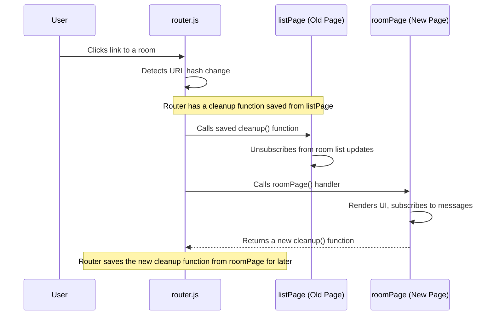

# Chapter 5: Page Controllers and Lifecycle

In the [previous chapter](simple-hash-based-router-174192633.md), we explored our application's "traffic cop"—the [Simple Hash-Based Router](simple-hash-based-router-174192633.md). We saw how it reads the URL hash and calls the correct JavaScript function, like `roomPage`, to display a view.

But what exactly does `roomPage` do once it's called? And, just as importantly, what happens when we click a link and navigate *away* from that room? How does the application clean up after itself? This set of responsibilities—setup, execution, and cleanup—is what we call the "lifecycle" of a page.

### The Problem: Lingering Ghosts

Imagine you're in the "General" chat room. The page is actively listening for new messages and typing indicators for that specific room. Now, you navigate to the "Random" chat room.

If we're not careful, the old code for the "General" room might still be running in the background, listening for updates. It would be trying to add new "General" messages to a page that no longer exists! This is a "memory leak." It's like leaving the radio on in a car you've already parked and walked away from. It wastes energy (memory and CPU) and can lead to strange bugs.

We need a system where each page can neatly clean up its own mess before the next page takes over.

### The Solution: The Page Controller and its Cleanup Contract

Each of our page-rendering functions (like `roomPage` or `listPage`) acts as a **Page Controller**. It's the manager responsible for a single view and its entire lifecycle.

This lifecycle has three main phases:

1.  **Setup**: When you navigate to a page, the controller function is called. It immediately renders the basic HTML structure (the "skeleton") so the user sees something right away.
2.  **Active**: The controller then fetches data, attaches event listeners (like for buttons), and subscribes to reactive stores from the `HawkiClient` to receive live updates. The page is now fully interactive.
3.  **Cleanup**: To solve our "lingering ghosts" problem, our controller function can `return` another function. This returned function is the "cleanup crew." The router promises to call this cleanup function right before navigating to a new page.

This creates a simple but powerful contract: "Here's how to show my page, and here's how to clean it up when you're done with it."

### The Anatomy of a Page Controller: `roomPage.js`

Let's look at a simplified version of `public/js/routes/roomPage.js` to see this in action.

```javascript
// public/js/routes/roomPage.js (Simplified)
import { getHawkiClient } from '../bootstrap/handleHawkiClientCreation.js';
import { setAppContent } from '../utils.js';

export function roomPage(goTo, params) {
  // --- SETUP PHASE ---
  const client = getHawkiClient();
  const pageElement = document.createElement('div');
  pageElement.innerHTML = `
    <h3>Room: ${params.roomSlug}</h3>
    <div id="messages">Loading messages...</div>
  `;
  setAppContent(pageElement);

  // --- ACTIVE PHASE ---
  const messagesStore = client.rooms.messages.list(params.roomSlug).store();
  
  const unsubscribe = messagesStore.subscribe(messages => {
    // This code runs whenever new messages arrive
    // and re-renders the message list.
  });

  // --- CLEANUP PHASE ---
  return unsubscribe; // Return the cleanup function!
}
```

Let's break this down:
1.  **Setup**: It immediately creates a basic HTML template with a "Loading..." message and puts it on the screen using `setAppContent`. The user gets instant feedback.
2.  **Active**: It uses the [HawkiClient Integration & Reactive State](hawkiclient-integration-reactive-state-1813149943.md) to get a `messagesStore`. The `.subscribe()` method tells the client, "Please run this function every time the message list for this room changes."
3.  **Cleanup**: The `.subscribe()` method returns an `unsubscribe` function. This is our magic key! By returning `unsubscribe`, the `roomPage` controller tells the router, "When the user leaves this page, please call this function to stop the message updates."

### Handling Multiple Subscriptions

What if a page needs to listen to multiple things? For example, the `roomPage` also listens for typing indicators. We can't return multiple functions, so what do we do?

We use a `Set`. A `Set` is a special JavaScript object that holds a unique collection of items. Our page controller can add all its cleanup functions to a `Set` and then return the entire set.

```javascript
// public/js/routes/roomPage.js (With multiple cleanups)

export function roomPage(goTo, params) {
  const client = getHawkiClient();
  const cleanupQueue = new Set(); // Our collection of cleanup functions

  // Subscribe to messages and add its cleanup function to the queue
  cleanupQueue.add(
    client.rooms.messages.list(...).store().subscribe(...)
  );

  // Subscribe to typing indicators and add its cleanup too
  cleanupQueue.add(
    client.rooms.typing.state(...).subscribe(...)
  );

  // Return the entire set
  return cleanupQueue;
}
```

Now, the controller is giving the router a whole list of chores to do when the user navigates away.

### How the Router Enforces the Contract

The "magic" happens inside our `router.js` file. It's designed to manage this lifecycle.



Here's the simplified logic inside `router.js` that makes this diagram a reality:

```javascript
// public/js/router.js (Simplified Logic)
let cleanup = null; // A variable to hold the current page's cleanup function(s)

const route = () => {
  // ... code to find the new page to show ...

  // 1. CLEAN UP THE OLD PAGE
  if (cleanup) {
    if (typeof cleanup === 'function') {
      cleanup(); // If it's one function, call it
    } else {
      cleanup.forEach(fn => fn()); // If it's a Set, call all of them
    }
    cleanup = null;
  }

  // 2. CALL THE NEW PAGE'S CONTROLLER
  const newCleanup = newPageController(goTo, params);

  // 3. SAVE THE NEW CLEANUP FOR LATER
  cleanup = newCleanup;
};
```
1.  When a navigation event occurs, the router first checks if it has a `cleanup` function from the *previous* page.
2.  If it does, it runs it. This is the crucial step that prevents memory leaks.
3.  Only then does it call the controller for the *new* page.
4.  It takes the return value from the new controller (the new cleanup function) and saves it in the `cleanup` variable, ready for the next navigation.

This elegant enter-and-exit pattern ensures our application stays clean, efficient, and bug-free.

### Conclusion

You've just learned one of the most important architectural patterns in our application: the page controller lifecycle.

*   Every view is managed by a **Page Controller**: a single function responsible for its setup, active state, and cleanup.
*   Controllers can `return` a **cleanup function** (or a `Set` of them) to tell the router how to tear down the page.
*   This cleanup function typically **unsubscribes** from reactive stores, stopping live data updates for pages that are no longer visible.
*   The **router** orchestrates this lifecycle, ensuring the old page is cleaned up before the new page is displayed.

Our page controllers can get quite large, especially a complex one like `roomPage`. It handles rendering the room details, the message list, the input box, and more. How can we break this B_I-G function into smaller, more manageable, and reusable pieces?

Next, we'll explore how we can create our own simple UI components to build complex pages from smaller building blocks.

[Chapter 6: Function-based UI Components](function-based-ui-components-740881728.md)

