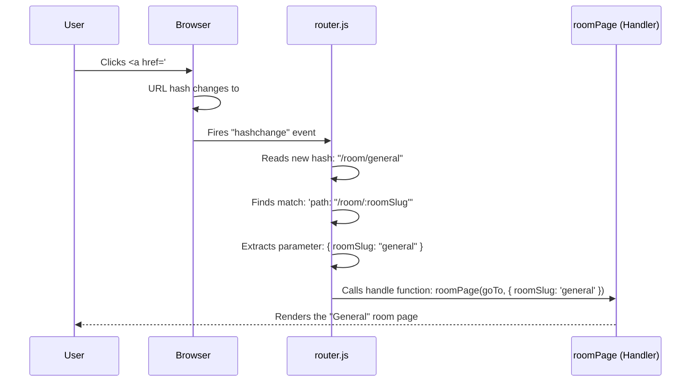

# Chapter 4: Simple Hash-Based Router

In the [previous chapter](application-bootstrap-and-authentication-flow-1587883851.md), we successfully guided our user through the login and authentication gates. The very last step in our startup script was a single command: `router.route()`. This is the moment our application truly comes to life.

But what exactly is this "router"? How does it know which page to show? Let's imagine you've just arrived at a grand central station. You need to get to the "General Discussion" platform. You look up at a big departure board that tells you which track to go to. Our router is that departure board. It reads your destination from the URL and directs you to the correct "platform" — our page-rendering functions.

### The Problem: Navigating a "Single Page"

In a traditional website, every link click loads a brand new HTML file from the server. But in our Single Page Application (SPA), we only have one `index.html`. So how do we create the illusion of multiple pages?

Consider these scenarios:
*   A user visits `yourapp.com/#/`. They should see the list of all chat rooms.
*   They click a link, and the URL changes to `yourapp.com/#/room/general`. The screen should now show the "General" chat room.
*   They bookmark this URL and come back tomorrow. The app should open directly to the "General" chat room.

The key to all this is the little `#` symbol in the URL. It's called the "hash" or "fragment." Anything after the hash is handled *only* by your browser; it's never sent to the server. This makes it the perfect tool for building a navigation system that runs entirely in the user's browser.

### The Solution: The Router's Rulebook

Our router is a custom piece of JavaScript that acts as the application's traffic cop. We give it a "rulebook" when we create it, and it uses this book to direct traffic. This rulebook is just a simple list of objects, defined in `public/js/index.js`.

```javascript
// public/js/index.js (simplified)
const router = createRouter([
  { name: 'home', path: '/', handle: listPage },
  { name: 'room', path: '/room/:roomSlug', handle: roomPage },
  { name: 'profile', path: '/profile', handle: userProfilePage }
  // ... more routes
]);
```

Each object in this list is a "route" and has three important parts:
*   **`path`**: This is the URL pattern the router looks for. A path like `/profile` is static. A path like `/room/:roomSlug` is dynamic. The colon `:` tells the router that `:roomSlug` is a placeholder for any value.
*   **`handle`**: This is the JavaScript function to run when the path matches. These are our "page functions" from Chapter 1, like `listPage` or `roomPage`.
*   **`name`**: A simple, human-readable name for the route. This isn't used for matching, but it's essential for navigating programmatically, as we'll see later.

### How a Route is Matched

So, what happens when you click a link? Let's follow the journey from a click to a new page appearing on the screen.



1.  **The Click**: The user clicks a link. The browser sees the `href` is `#/room/general` and updates the URL.
2.  **The Event**: Because the hash part of the URL changed, the browser fires a built-in event called `hashchange`.
3.  **The Listener**: Our `router.js` is always listening for this specific event.
    ```javascript
    // public/js/router.js
    // This tells the browser to call our `route` function
    // every time the URL hash changes.
    window.addEventListener('hashchange', route);
    ```
4.  **The Match**: The router's `route` function grabs the new path (`/room/general`) and scans its rulebook. It finds that `/room/general` is a perfect match for the pattern `/room/:roomSlug`.
5.  **The Execution**: The router extracts the value "general" and saves it as the `roomSlug` parameter. It then calls the associated handler function, `roomPage`, passing it the parameters it found. The `roomPage` function then takes over to build and display the page content.

### A Peek Inside the Router's Engine

The logic for matching a route is surprisingly simple. At its core, it's just a loop.

```javascript
// public/js/router.js (simplified logic)
const route = () => {
  // 1. Get the current path from the URL hash
  const currentPath = window.location.hash.replace(/^#/, '') || '/';

  // 2. Loop through all known routes
  for (const route of compiledRoutes) {
    // 3. Check if the path matches the route's pattern
    const match = currentPath.match(route.regex);
    if (match) {
      const params = {}; // e.g., { roomSlug: 'general' }
      // ...code to extract params from the match...

      // 4. Call the handler and stop!
      route.handle(goTo, params);
      return;
    }
  }

  // If no route was found, show an error.
  onError('warning', `No route matched for path: ${currentPath}`);
};
```
The router converts each `path` string (like `/room/:roomSlug`) into a more powerful matching pattern called a "Regular Expression" when it's first created. This allows it to easily check if a URL fits a pattern and pull out any parameters.

### Taking the Wheel: Programmatic Navigation with `goTo()`

Sometimes, a user action should trigger a navigation change. For example, after a user successfully creates a new chat room, we want to automatically take them to that new room's page. We can't use a link here, because the action happens in our JavaScript code.

This is where the router's `goTo()` method comes in. It lets us navigate from *anywhere* in our code.

```javascript
// An example from somewhere in our app...
async function handleCreateRoom(newRoomName) {
  // ...code to create the room on the server...

  // Now, navigate to the new room's page.
  // We use the route's 'name' and pass the 'roomSlug' parameter.
  router.goTo('room', { roomSlug: newRoomName });
}
```

This is why we give each route a `name`. The `goTo('room', ...)` function does the following:
1.  Finds the route object with `name: 'room'`.
2.  Looks at its path: `/room/:roomSlug`.
3.  Replaces the `:roomSlug` placeholder with the value we provided (`newRoomName`).
4.  Sets the browser's URL hash to the final result, e.g., `#/room/my-new-room`.

And what happens when the hash changes? You guessed it! The `hashchange` event fires, and our router's main `route()` function takes over, just as if the user had clicked a link.

### Conclusion

You've just learned how our application's entire navigation system works. It's a simple but powerful "traffic cop" that directs the user experience.

*   Our router uses the URL **hash (`#`)** to manage "pages" without reloading the browser.
*   It uses a **rulebook** (an array of route objects) to map URL `path` patterns to page-handling `handle` functions.
*   It can extract **dynamic parameters** from the URL, like the room's name in `/#/room/general`.
*   It provides a **`goTo()` method** for navigating programmatically from within our JavaScript code.

Now we know *how* we get routed to a page function like `roomPage`. But what does that function do once it's called? How does it manage its own state, and what happens when we navigate away from it?

Next, we will take a deep dive into the structure and responsibilities of these page-handling functions.

[Chapter 5: Page Controllers and Lifecycle](page-controllers-and-lifecycle-1365675545.md)

