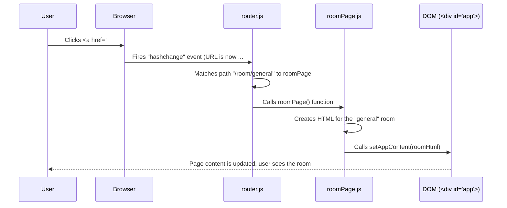

# Chapter 1: Vanilla JS SPA Architecture & Workflow

Now that you've set up your local development environment with the bin/env helper [bin/env - Your local dev helper](bin-env-your-local-dev-helper-862670637.md), which simplifies running and testing the project, we can explore the foundation of the `hawki-client-example` application.

Welcome to your first look inside the `hawki-client-example` project! Before we dive into the specific features of HAWKI, it's essential to understand the foundation on which this application is built.

Imagine watching a play. In a traditional play, when the scene changes, the curtain falls, and the audience might even move to a different room for the next act. This is like a traditional website, where clicking a link reloads the entire page. Now, imagine a more modern play on a single, versatile stage. The lights dim, actors and props change, and a new scene unfolds before your eyes without you ever leaving your seat. This is a **Single Page Application (SPA)**.

Our application is an SPA, and we've built it using "Vanilla JS"—that is, pure JavaScript without a major framework like React, Vue, or Angular. This approach helps us focus on the core concepts of how modern web apps work.

In this chapter, we'll explore the basic architecture of our application: how it handles navigation and displays different "pages" without ever reloading.

### The Problem: Seamless Navigation

Let's consider a simple use case:

1.  A user lands on the homepage, which shows a list of chat rooms.
2.  The user clicks on a specific room, "General Discussion."
3.  The content on the screen changes to show the messages inside the "General Discussion" room.

Crucially, this entire process should happen instantly, without the browser's "loading" spinner appearing. How do we achieve this? We need a system that can watch the URL, and when it changes, swap out the content on the page accordingly.

### The Solution: A Router and Page Functions

Our application's architecture solves this with three key components:

1.  **A Single HTML "Stage"**: Our `index.html` is very simple. It contains a single `<div>` that acts as the main container for all our content.
    ```html
    <!-- public/index.html (simplified) -->
    <body>
      <div id="app"></div>
      <!-- Our JavaScript files are loaded here -->
    </body>
    ```
    Think of `<div id="app">` as the empty stage where all our scenes will be performed.

2.  **A "Traffic Cop" (`router.js`)**: We have a custom JavaScript file that acts like a traffic cop for our application. It watches the URL for changes (specifically, the part after the `#` symbol) and decides which "page" to show. This is our [Simple Hash-Based Router](simple-hash-based-router-174192633.md).

3.  **"Scene Builders" (Page Functions)**: For each "page" of our application (like the room list or a specific room), we have a JavaScript function that knows how to build the HTML for that scene. We'll explore these further in the [Page Controllers and Lifecycle](page-controllers-and-lifecycle-1365675545.md) chapter.

### Putting It All Together in `index.js`

Everything starts in `public/js/index.js`. This is our main script, the director of our play. Here, we define our application's "route map" and tell the router about our different page functions.

```javascript
// public/js/index.js

// 1. Import the router and our "page" functions
import {createRouter} from './router.js';
import {listPage} from './routes/listPage.js';
import {roomPage} from './routes/roomPage.js';

// 2. Create the router with a "route map"
const router = createRouter([
  { name: 'home', path: '/', handle: listPage },
  { name: 'room', path: '/room/:roomSlug', handle: roomPage },
  // ... more routes
]);
```

This code snippet is like a phonebook. It tells our `router` that when the URL hash is `/` (the root), it should call the `listPage` function. When the hash looks like `/room/some-name`, it should call the `roomPage` function.

The `listPage` function's job is to create the HTML for the room list and put it on our "stage".

```javascript
// public/js/routes/listPage.js (simplified)
import {setAppContent} from '../utils.js';

export function listPage() {
  const pageElement = document.createElement('div');
  pageElement.innerHTML = `
    <h1>All Chat Rooms</h1>
    <ul>
      <li><a href="#/room/general">General Discussion</a></li>
      <li><a href="#/room/random">Random</a></li>
    </ul>
  `;
  
  setAppContent(pageElement);
}
```

The most important part is the `setAppContent` function. It's a simple helper that takes the HTML we just created and places it inside our `<div id="app">`.

```javascript
// public/js/utils.js
export function setAppContent(el) {
  document.getElementById('app').replaceChildren(el);
}
```

This tiny function is the heart of our SPA's rendering mechanism. It finds the "stage" and completely replaces its contents with the new scene.

### The Application Workflow in Action

Let's trace what happens step-by-step when a user clicks the "General Discussion" link.



1.  **User Click**: The user clicks the link. The URL in the browser's address bar changes to `...#/room/general`.
2.  **Event Fired**: The browser sees the part after the `#` (the "hash") changed and notifies our application.
3.  **Router Listens**: Our `router.js` is always listening for this `hashchange` event.
    ```javascript
    // public/js/router.js
    // This line tells the browser to call our `route` function
    // every time the URL hash changes.
    window.addEventListener('hashchange', route);
    ```
4.  **Find and Execute**: The router checks its "route map," finds a match for `/room/general`, and calls the associated `roomPage` function.
    ```javascript
    // public/js/router.js (simplified logic)
    const currentPath = window.location.hash.substring(1); // gives "/room/general"

    for (const route of routes) {
      if (currentPath matches route.path) {
        // We found it! Call the function.
        route.handle(/*...arguments...*/); 
        return;
      }
    }
    ```
5.  **Render and Replace**: The `roomPage.js` function runs, generates the HTML for the room view, and uses `setAppContent()` to swap out the content inside `<div id="app">`.

The beautiful result is that the user sees a new page without any disruptive full-page reload. This entire structure—an entry point, a router, and page functions—forms the simple yet powerful backbone of our Vanilla JS SPA.

### Conclusion

You've just learned the fundamental architecture of our frontend application! We've seen that:
*   An SPA provides a fluid user experience by changing content dynamically instead of reloading the entire page.
*   Our app uses "Vanilla JS" to build this SPA from the ground up, giving us full control and a clear understanding of the mechanics.
*   A hash-based router acts as a traffic cop, mapping URL fragments (like `#/room/general`) to specific JavaScript functions.
*   These "page functions" are responsible for generating HTML and injecting it into a single, persistent container: `<div id="app">`.

So far, our pages are static. They don't display real data from a server or react to changes. How do we fetch our chat rooms and messages, and how do we make the UI update automatically when a new message arrives? That's the perfect transition to our next topic.

Next, we will explore how our application communicates with the backend and manages its data reactively.

[Chapter 2: HawkiClient Integration & Reactive State](hawkiclient-integration-reactive-state-1813149943.md)

